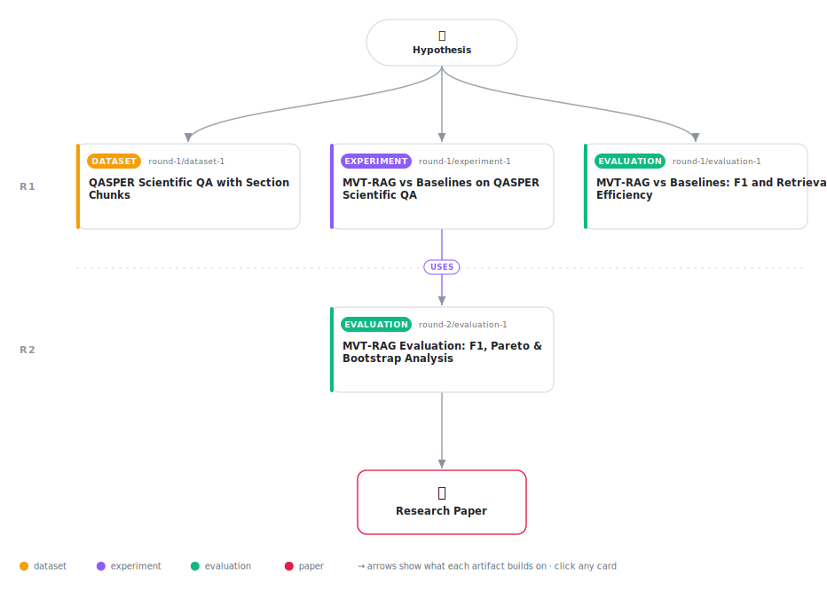

# Efficiency at a Cost: Applying the Marginal Value Theorem to Scientific Document Retrieval

<div align="center">

<a href="https://cdn.jsdelivr.net/gh/AMGrobelnik/ai-invention-7ae548-efficiency-at-a-cost-applying-the-margin@main/workflow.svg">
<picture>
  <source media="(prefers-color-scheme: dark)" srcset="workflow-dark.svg">
  
</picture>
</a>

<sub>🖱️ <b><a href="https://cdn.jsdelivr.net/gh/AMGrobelnik/ai-invention-7ae548-efficiency-at-a-cost-applying-the-margin@main/workflow.svg">Open the interactive diagram</a></b> — every card links to its artifact folder.</sub>

</div>

> **TL;DR** — MVT-RAG applies the Marginal Value Theorem from ecology to adaptive section switching in scientific RAG, treating document sections as foraging patches. On QASPER (223 questions), it achieves 3.8x retrieval efficiency over top-k-5 (1.3 vs 5.0 chunks/question) and is Pareto-non-dominated, but achieves significantly lower F1 (0.138 vs 0.217). Oracle analysis confirms the deficit is entirely due to under-retrieval. A corrected ablation (threshold=0.5, matching dataset median G_env=0.265) finds no benefit for adaptive over fixed threshold (p=0.68). The root cause is G_env over-estimation from single-chunk section sampling; multi-chunk averaging is proposed as the minimal fix.

<details>
<summary>Full hypothesis</summary>

The Marginal Value Theorem (MVT) provides an interpretable, training-free criterion for adaptive section switching in retrieval-augmented generation over long scientific documents, but its current single-chunk G_env estimator causes systematic under-retrieval that yields significantly lower answer quality than fixed-k baselines. On QASPER (223 questions, 100 papers), MVT-RAG achieves F1=0.138 vs. top-k-5 F1=0.217 (delta=-0.079, p<0.001) while retrieving 3.8x fewer chunks (1.30 vs. 5.0 per question). Oracle retrieval analysis localizes the failure entirely to retrieval—not generation: MVT-RAG oracle F1=0.140 vs. top-k-5 oracle F1=0.441 (gap=0.301). A corrected ablation (MVT-NoEnv fixed threshold=0.5, matching the dataset median G_env) shows the ecology-derived adaptive averaging provides no significant benefit over a fixed comparator (delta=+0.002, CI=[-0.007,+0.010], p=0.68). We now hypothesize three specific, testable next claims: (1) Adding top-k-1 and top-k-2 as baselines will determine whether MVT-RAG's Pareto non-dominance claim is genuine—if MVT-RAG F1 > top-k-1 F1, the efficiency advantage is real; otherwise the Pareto framing must be dropped. (2) Multi-chunk G_env averaging (mean of top-K chunks per section, K in {2,3,5}) will lower the stopping threshold, increase per-section retrieval, and close the oracle F1 gap without sacrificing the efficiency advantage over top-k-5—because G_env^(K) <= G_env^(1) always holds, this is a monotone correction in the right direction. (3) For multi-hop questions, section-visit recall measurement will distinguish between two competing failure modes: (a) MVT-RAG visits the wrong sections (G_env too high, low-potential sections never entered) vs. (b) MVT-RAG visits the right sections but exits too early. These two failure modes imply different fixes and the evidence does not currently discriminate between them. The MVT framework itself is not refuted—the null result on G_env ablation is attributable to noisy single-chunk estimation, not to the patch-switching structure—but the framework requires empirical validation of the G_env^(K) fix before a positive claim can be made.

</details>

[](https://cdn.jsdelivr.net/gh/AMGrobelnik/ai-invention-7ae548-efficiency-at-a-cost-applying-the-margin@main/paper.pdf) [](https://github.com/AMGrobelnik/ai-invention-7ae548-efficiency-at-a-cost-applying-the-margin/tree/main/paper_latex)

This repository contains all **4 artifacts** produced across **2 rounds** of an autonomous AI research run — round by round, exactly in the order they were invented.

## Round 1

| Artifact | Type | Demo | Source | Builds on |
|----------|------|------|--------|-----------|
| **[QASPER Scientific QA with Section Chunks](https://github.com/AMGrobelnik/ai-invention-7ae548-efficiency-at-a-cost-applying-the-margin/tree/main/round-1/dataset-1)** | [](https://github.com/AMGrobelnik/ai-invention-7ae548-efficiency-at-a-cost-applying-the-margin/tree/main/round-1/dataset-1) | [](https://colab.research.google.com/github/AMGrobelnik/ai-invention-7ae548-efficiency-at-a-cost-applying-the-margin/blob/main/round-1/dataset-1/demo/data_code_demo.ipynb) | [](https://github.com/AMGrobelnik/ai-invention-7ae548-efficiency-at-a-cost-applying-the-margin/tree/main/round-1/dataset-1/src) | — |
| **[MVT-RAG vs Baselines on QASPER Scientific QA](https://github.com/AMGrobelnik/ai-invention-7ae548-efficiency-at-a-cost-applying-the-margin/tree/main/round-1/experiment-1)** | [](https://github.com/AMGrobelnik/ai-invention-7ae548-efficiency-at-a-cost-applying-the-margin/tree/main/round-1/experiment-1) | [](https://colab.research.google.com/github/AMGrobelnik/ai-invention-7ae548-efficiency-at-a-cost-applying-the-margin/blob/main/round-1/experiment-1/demo/method_code_demo.ipynb) | [](https://github.com/AMGrobelnik/ai-invention-7ae548-efficiency-at-a-cost-applying-the-margin/tree/main/round-1/experiment-1/src) | — |
| **[MVT-RAG vs Baselines: F1 and Retrieval Efficiency](https://github.com/AMGrobelnik/ai-invention-7ae548-efficiency-at-a-cost-applying-the-margin/tree/main/round-1/evaluation-1)** | [](https://github.com/AMGrobelnik/ai-invention-7ae548-efficiency-at-a-cost-applying-the-margin/tree/main/round-1/evaluation-1) | [](https://colab.research.google.com/github/AMGrobelnik/ai-invention-7ae548-efficiency-at-a-cost-applying-the-margin/blob/main/round-1/evaluation-1/demo/eval_code_demo.ipynb) | [](https://github.com/AMGrobelnik/ai-invention-7ae548-efficiency-at-a-cost-applying-the-margin/tree/main/round-1/evaluation-1/src) | — |

## Round 2

| Artifact | Type | Demo | Source | Builds on |
|----------|------|------|--------|-----------|
| **[MVT-RAG Evaluation: F1, Pareto & Bootstrap Analysis](https://github.com/AMGrobelnik/ai-invention-7ae548-efficiency-at-a-cost-applying-the-margin/tree/main/round-2/evaluation-1)** | [](https://github.com/AMGrobelnik/ai-invention-7ae548-efficiency-at-a-cost-applying-the-margin/tree/main/round-2/evaluation-1) | [](https://colab.research.google.com/github/AMGrobelnik/ai-invention-7ae548-efficiency-at-a-cost-applying-the-margin/blob/main/round-2/evaluation-1/demo/eval_code_demo.ipynb) | [](https://github.com/AMGrobelnik/ai-invention-7ae548-efficiency-at-a-cost-applying-the-margin/tree/main/round-2/evaluation-1/src) | <sub><i>uses:</i><br/>[experiment‑1&nbsp;(R1)](https://github.com/AMGrobelnik/ai-invention-7ae548-efficiency-at-a-cost-applying-the-margin/tree/main/round-1/experiment-1)</sub> |

## Repository Structure

Artifacts are grouped by the round of invention that produced them. Each
artifact has its own folder with source code and a self-contained demo:

```
.
├── round-1/                         # One folder per round of invention
│   ├── experiment-1/
│   │   ├── README.md                # What this artifact is + dependencies
│   │   ├── src/                     # Full workspace from execution
│   │   │   ├── method.py            # Main implementation
│   │   │   ├── method_out.json      # Full output data
│   │   │   └── ...                  # All execution artifacts
│   │   └── demo/                    # Self-contained demo
│   │       └── method_code_demo.ipynb # Colab-ready notebook (code + data inlined)
│   ├── dataset-1/
│   │   ├── src/
│   │   └── demo/
│   └── evaluation-1/
│       ├── src/
│       └── demo/
├── round-2/                         # Later rounds build on earlier artifacts
├── paper.pdf                        # Research paper
├── paper_latex/                     # LaTeX source files
├── workflow.svg                     # Artifact dependency diagram (this page's header)
└── README.md
```

## Running Notebooks

### Option 1: Google Colab (Recommended)

Click the "Open in Colab" badges above to run notebooks directly in your browser.
No installation required!

### Option 2: Local Jupyter

```bash
# Clone the repo
git clone https://github.com/AMGrobelnik/ai-invention-7ae548-efficiency-at-a-cost-applying-the-margin
cd ai-invention-7ae548-efficiency-at-a-cost-applying-the-margin

# Install dependencies
pip install jupyter

# Run any artifact's demo notebook
jupyter notebook <artifact_folder>/demo/
```

## Source Code

The original source files are in each artifact's `src/` folder.
These files may have external dependencies - use the demo notebooks for a self-contained experience.

---
*Generated by AI Inventor Pipeline - Automated Research Generation*
